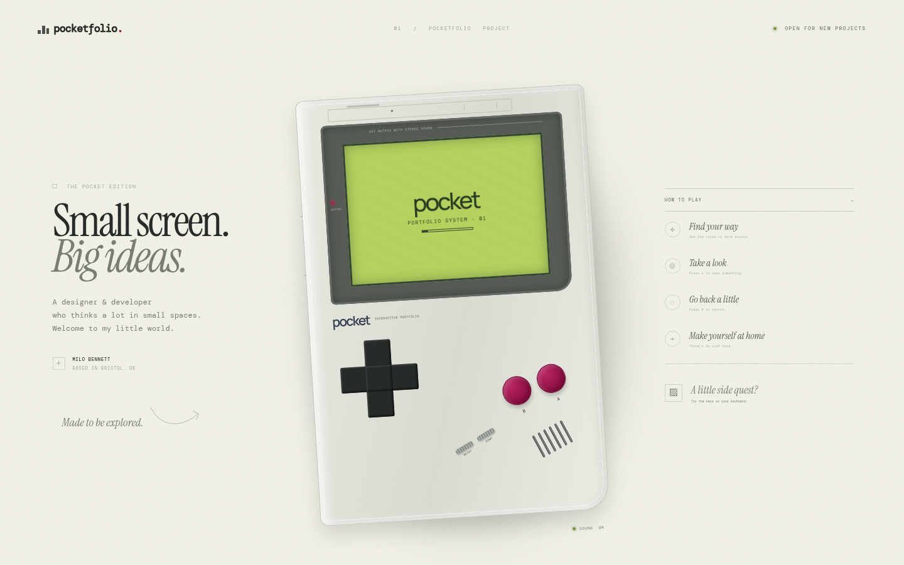

# Pocketfolio

An interactive, responsive recreation of the Game Boy–inspired portfolio shown in the referenced X post.



## Credit

Design reference: [original tweet by @Angaisb_](https://x.com/Angaisb_/status/2095964361105789424?s=20).

This recreation is an independent implementation created for demonstration purposes.

## Run

Open `index.html` directly, or serve the directory:

```bash
python3 -m http.server 4173
```

Use the on-screen D-pad and A/B buttons, or keyboard arrows, Enter/A, and Escape/B. Controls include synthesized retro sound and an on-console sound toggle.
